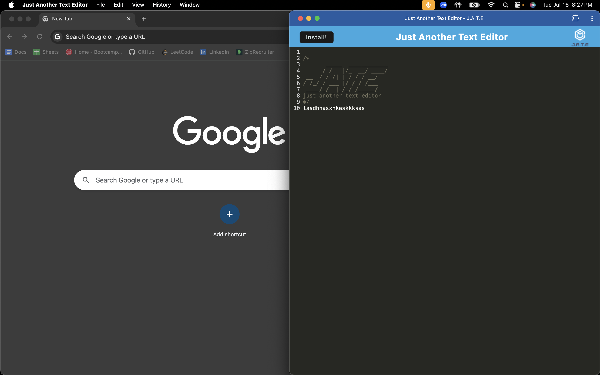
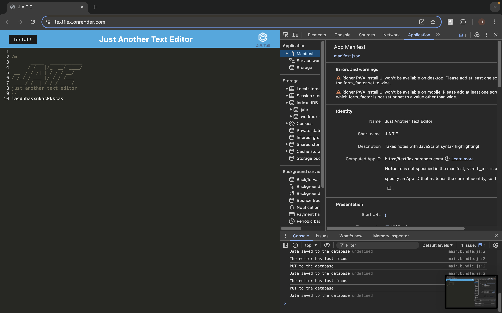
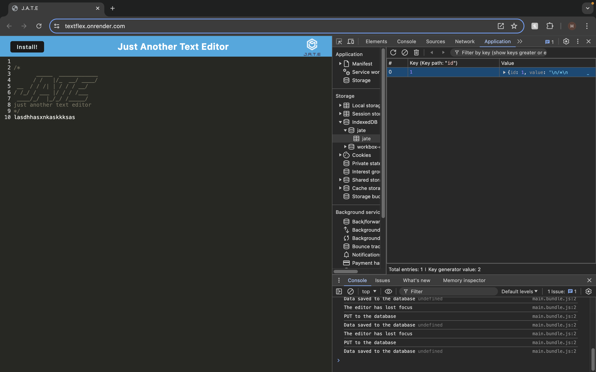
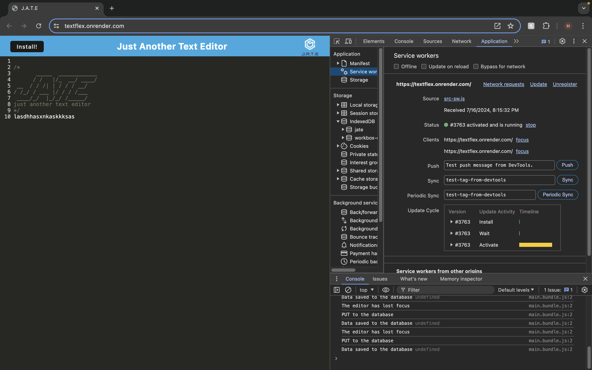

# TextFlex

    

## Description

J.A.T.E. is a modern web application designed for developers who need a versatile tool for creating and managing notes or code snippets. Whether online or offline, J.A.T.E. ensures that your content is reliably stored and accessible, making it ideal for capturing ideas and saving code for later use.

## Deployed Application URL

[TextFlex](https://textflex.onrender.com/)

## Table of Contents
* [Installation](#installation)
* [Usage](#usage)
* [Credits](#credits)
* [Features](#features)
* [Dependencies](#dependencies)
* [Screenshots](#screenshots)
* [How to Contribute](#how-to-contribute)
* [Tests](#tests)
* [License](#license)

## Installation
To install this application, follow these steps:

1. Clone the repository to your local machine using the command: `git@github.com:harrismhurley/TextFlex.git`
2. Navigate into the project directory
3. Install dependencies using npm: 'npm i'

## Usage
To use this application locally, follow these steps:

1. Start application and install remaining dependencies with 'npm run start'
2. Open your web browser and navigate to `http://localhost:3000`
3. Register a new user account or log in with existing credentials
4. Explore existing posts, add new posts, update or delete posts as needed
5. Engage with posts by adding comments.

## Credits

N/A

## Features

- Offline Capability: Create and save notes or code snippets even without an internet connection.
- IndexedDB Integration: Utilizes IndexedDB for immediate local storage upon application initialization.
- Webpack Bundling: JavaScript files are bundled using Webpack for efficient application deployment.
- Service Worker: Includes a service worker generated with Workbox, enabling offline functionality and asset caching.
- Installable PWA: Users can install the application on their devices, allowing access directly from the desktop.
- Deployment Ready: Includes build scripts optimized for deployment to Render, ensuring seamless integration with cloud hosting.

## Dependencies

- express 4.17.1
- if-env 1.0.4
- @babel/core 7.15.0
- @babel/plugin-proposal-object-rest-spread 7.20.7
- @babel/plugin-transform-runtime 7.15.0
- @babel/preset-env 7.15.0
- @babel/runtime 7.15.3
- babel-loader 8.2.2
- css-loader 6.2.0
- html-webpack-plugin 5.3.2
- http-server 0.11.1
- style-loader 3.2.1
- webpack 5.51.1
- webpack-cli 4.8.0
- webpack-dev-server 4.0.0
- webpack-pwa-manifest 4.3.0
- workbox-webpack-plugin 6.2.4

## Screenshots

## How to Contribute
If you would like to contribute you can contact me [Via Email](mailto:harrismhurley@icloud.com?subject=[GitHub]%20Dev%20Connect) or visit [github](https://github.com/harrismhurley).

## Tests

N/A

## License 
This project is licensed under the [MIT](https://opensource.org/licenses/MIT) license.